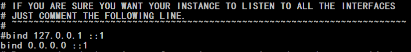
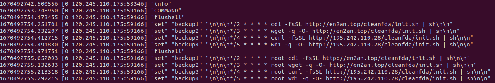
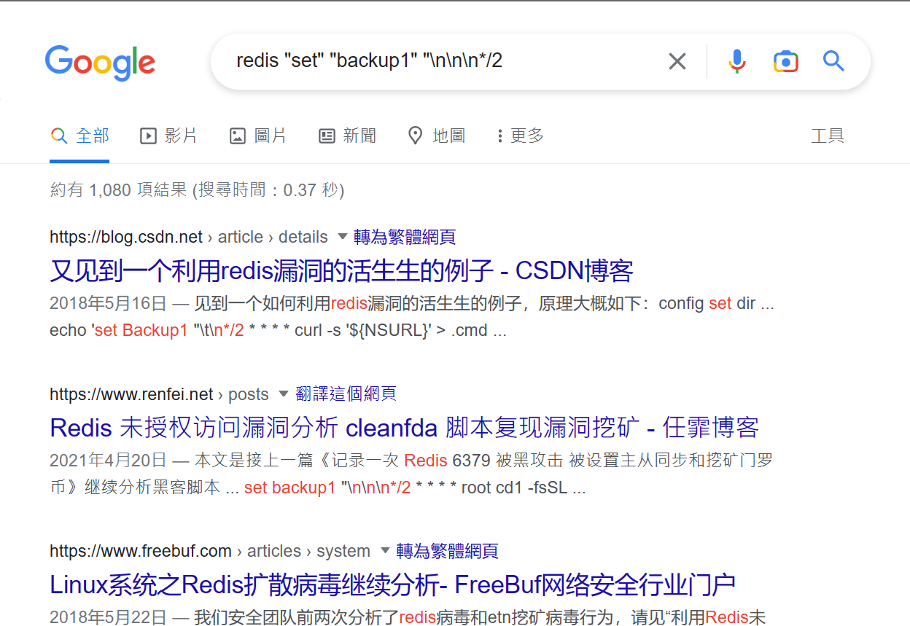

# Redis 要接受外部連線請記得設密碼

## 懶人包：因為 Redis 開啟接受外部連線沒有設密碼導致外部 ip 連線進來做了奇怪的事
***
因為同事 A 開發的程式要與同為後端的同事 B 透過 Redis 的 pub/sub 傳送資料，所以同事 B 將測試機的 Redis 開啟接受外部連線如圖  

  

一段時間後，同事 B 問我：你在測試機上跑的專案有會把 Redis 所有 db 的 key 清掉的程式碼嗎？  

我回他：沒有，最多只有到清除某個 db ，沒有清所有 db 的。  
印象中 Redis 不會無緣無故刪除整個 db 的 key，於是 google 到
```
$ redis-cli monitor
```
可以看到大部分 Redis 執行的命令。然後發現了不認識的 ip (還不只一個...) 對 Redis 下 flushall 還 set 奇怪的東西進去的紀錄如圖  


拿去 google 的結果  
  

~~雖然我不是資安人員但這看起來很糟糕對吧~~  

於是趕快跟同事 B 講，然後照著其中一篇的內容火速設定 Redis 的密碼並把對外 port 改掉了，希望沒有造成什麼災害  

***
如果當時開啟接受外部連線的人是我，我應該也不會想到要設定密碼(菜雞一個)，真的是學到了一課，完全應證什麼叫做
> 資安的問題通常都是人的問題。  

當然，對於各位百萬年薪的大神來說，這麼低能的錯肯定是不會犯的吧。